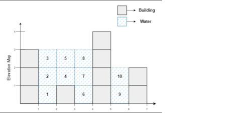

1. Implement the CustomStack class Increament bottom k elements:

CustomStack(int maxSize) Initializes the object with maxSize which is the maximum number of elements in the stack.
void push(int x) Adds x to the top of the stack if the stack has not reached the maxSize.
int pop() Pops and returns the top of the stack or -1 if the stack is empty.
void inc(int k, int val) Increments the bottom k elements of the stack by val. If there are less than k elements in the stack, increment all the elements in the stack.
Example 1:
```
Input
["CustomStack","push","push","pop","push","push","push","increment","increment","pop","pop","pop","pop"]
[[3],[1],[2],[],[2],[3],[4],[5,100],[2,100],[],[],[],[]]
Output
[null,null,null,2,null,null,null,null,null,103,202,201,-1]
Explanation
CustomStack stk = new CustomStack(3); // Stack is Empty []
stk.push(1); // stack becomes [1]
stk.push(2); // stack becomes [1, 2]
stk.pop(); // return 2 --> Return top of the stack 2, stack becomes [1]
stk.push(2); // stack becomes [1, 2]
stk.push(3); // stack becomes [1, 2, 3]
stk.push(4); // stack still [1, 2, 3], Do not add another elements as size is 4
stk.increment(5, 100); // stack becomes [101, 102, 103]
stk.increment(2, 100); // stack becomes [201, 202, 103]
stk.pop(); // return 103 --> Return top of the stack 103, stack becomes [201, 202]
stk.pop(); // return 202 --> Return top of the stack 202, stack becomes [201]
stk.pop(); // return 201 --> Return top of the stack 201, stack becomes []
stk.pop();
```
2. Design a SpecialStack that supports push(x), pop(), peek(), and getMin() in O(1) time.

* push(x) → add element x
* pop() → remove top element
* peek() → return top element without removing; -1 if empty
* getMin() → return minimum element; -1 if empty


3.

Given an array arr[], find the Previous Smaller Element (PSE) for every element in the array.

The Previous Smaller Element of an element x is defined as the first element to its left in the array that is smaller than x.
If no such element exists for a particular position, the PSE should be considered as -1.
 Examples: 
```
Input: arr[] = [1, 6, 2]
Output: [-1, 1, 1]
Explanation: For the first element 1, there is no element to its left, so the result is -1. For 6, the previous smaller element is 1. For 2, the previous smaller element is also 1, since it is the closest smaller number when looking left.

Input: arr[] = [1, 5, 0, 3, 4, 5]
Output: [-1, 1, -1, 0, 3, 4]
Explanation: 
For 1, no element on the left → -1
For 5, the previous smaller element is 1
For 0, no smaller element on the left → -1
For 3, the previous smaller element is 0
For 4, the previous smaller element is 3
For the last 5, the previous smaller element is 4
```
1. Given an array arr[] of size n consisting of non-negative integers, where each element represents the height of a bar in an elevation map and the width of each bar is 1, determine the total amount of water that can be trapped between the bars after it rains.

Trapping Rainwater Problem
Trapping Rainwater Problem
Examples:  



Input: arr[] = [3, 0, 1, 0, 4, 0, 2]
Output: 10
Explanation: The expected rainwater to be trapped

Input: arr[] = [3, 0, 2, 0, 4]
Output: 7
Explanation: We trap 0 + 3 + 1 + 3 + 0 = 7 units.

Input: arr[] = [1, 2, 3, 4]
Output: 0
Explanation: We cannot trap water as there is no height bound on both sides